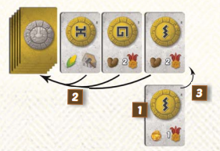
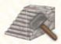

# Tawantinsuyu

## Theme

偉大なるサパ・インカのパチャクティは、彼の子孫に太陽神であるインティを崇拝するように命じ、彼の名の下にラマのように帝国を広めるように命じました。
パチャクティの後継者になるためには、誰が人々の目に最も名声を得ることができるかを競う必要があります。
神々を祀ったり、美しい織物からタペストリーを作ったり、新帝国の4つの地域であるチンチャイユ、アンティスユ、クラスユ、クンティスユへの征服を行ったりと、名声を得ることができます。

有名になるために必要な道はたくさんありますが、一つ確かなことは、中央の偉大なコリカンチャ寺院から、丘の中腹や下の村の工房までの長い旅です。
インカ文化の慣習として、コリカンチャ寺院の周りの斜面は段々畑になっています。
これにより、トウモロコシやジャガイモを収穫したり、石や金を採掘したり、織物職人が織物を生産したり、建築家が工房を建てたりすることができる平らな土地ができました。

残念なことに、寺院からこれらの段丘に降りるのは骨が折れそうな作業なので、丘の上で働く人々は皆、この下りの旅を楽にするための階段を作る人に名声を与えたいと思っています。
タワンティンスユのために前進する多くのパスがありますが、偉大なパチャクティの後継者になるための明確なパスはありません。
征服を通して帝国を拡大し、何世紀にもわたって語り継がれるタペストリーを作り、民衆やインティの像のためにステップを建設して名声を得、次のサパ・インカとしての地位を確保しましょう。

## SetUp

1. メインボードを中央に置く。リソースはボードの横にまとめておいておきます。
2. 各プレイヤーは好きな色を選び、その色の司祭トークン、スコアマーカー、ステップマーカー（5個）、寺院マーカー、征服マーカー（10個）を受け取ります。 
スコアマーカーは **10** のところに置きます。寺院マーカーはメインボード右側にある寺院トラックの最下部に置きます。
3. コリカンチャタイルをランダムに回転し、メインボード上の丘の中央に置きます。（初めてのプレイの場合はこのタイルを利用せず、メインボードに記述されているコリカンチャの利用を推奨します）
4. 2人プレイの場合、各色1ワーカーを取り除き、箱に戻します（このゲームでは利用しません）
5. 3人プレイの場合、各色2ワーカーを取り除き、箱に戻します（このゲームでは利用しません）
6. 各色2ワーカーをバッグに入れます。各プレイヤーはその袋から2ワーカーを取り出し、自分の駒として持っておきます。
もし2つとも同じ色だった場合は、さらに1つワーカーを引いて、同じ色のワーカーの1つをバッグに戻してください。
7. 残りのすべてのワーカをバッグに入れます。その後バッグからワーカーを引き、メインボード左側にある村エリアに置いていきます。
何個置くかはメインボードに記述されている数字をもとに、プレイ人数に合わせておいてください。
8. メインボード左下の遊牧民エリアに、プレイ人数に合わせた（メインボード上に記述されています）ワーカーを置きます。
9. 2人プレイの場合、コリカンチャの周りにある 👤2 のスペースにワーカーを置いていきます（最上段だけで、中段以降は最初のフェスティバル以降に置かれます）
10. 建物タイルを裏面の種類（生産と能力）で分けて、裏向きに積み上げて2つの山を作ります。各山をシャッフルし、それぞれ上から2枚を公開します。これが建物マーケットになります。
11. 軍隊カードをシャッフルして山札にし、建物マーケットの傍に裏向きで置いておきます。
12. 神アイコンをシュルごとに分けて、建物マーケットの傍に置いておきます。
13. 織物タイルを下記の通りに設置します。
   1. 初期織物タイル4枚を表面を上にして並べて置いておきます
   2. 3人プレイの場合は 👤4 と描かれた織物タイルを取り除き、箱に戻します
   3. 2人プレイの場合は 👤4 と 👤3+ と描かれた織物タイルを取り除き、箱に戻します
   4. 残った織物タイルを裏向きの山札にしてシャッフルし、一番上のカードを公開します
14. 一番最近野菜を収穫した人がスタートプレイヤーになります。もしくは、ランダムにスタートプレイヤーを決めます。
15. ターン順に、各プレイヤーは初期織物タイルを1枚とります。残った初期織物タイルは箱に戻します。
16. 各プレイヤーはサプライから石を2つ受け取ります
17. 神カードを裏向きの山札にしてシャッフルし、各プレイヤーに8枚配ります。
各プレイヤーはそこから3枚を手札として残し、残りの5枚をプレイして前に出します。
最後手番のプレイヤーから逆順に、プレイされた5枚のカードに描かれた利益を受け取ります。（ここで得た利益は、ほかの利益の支払いに利用できます） 
この処理が終わったら、建物マーケットを補充します。
すべてのプレイヤーが利益を受け取ったら、プレイされた神カードを山札に戻し、シャッフルします。
その後、プレイヤー人数2/3/4人に合わせて神カードの山札の上から3/4/5枚を表を向けて公開します。
（これをCentral Offerと呼びます）
18. フェスティバルタイルをゲームボードの傍に置いておきます。

## ターンの進め方

**最初ターンの特殊ルール**

ゲームの最初のあなたのターンに、あなたは自分のハイプリーストをコリカンチャタイル上のいずれかのスペースに配置することから始めます(他のプレイヤーのハイプリーストが既に占有している場合も同様です)。
この配置はあなたのハイプリーストの開始位置を決定するためのものであり、後述のルールに記載されているハイプリーストの二次的な行動と混同してはいけません。

あなたのターンでは、以下の2つのオプションから1つを選んで実行します。

1. **ワーカーを配置**：神カードを1枚捨てるか1ゴールドを払うことで、手持ちのワーカー1体をゲームボードに配置します。
2. 好きな順番で、以下のセカンダリーアクション4種類のうち、別の2つを実行します。
   1. ハイプリーストの移動
   2. 祈り
   3. 訓練
   4. 雇用

加えてフリーアクションとして、ターン中であれば好きなタイミングで軍隊カードを手札から好きな枚数捨てて、捨てたカードに描かれている資源を得ることができます。
ターン中であればこのフリーアクションは何回でも実行することができます。

**ターン終了時の処理**

- ターン終了時に、ワーカーを雇用する機会があります。しかし、3体以上のワーカーを所持してターンを終了することはできません。詳しくは「ターン終了時の雇用」の節を参照してください。
- ターン終了時に村エリアにワーカーが置かれていない場合、フェスティバルが行われます。
- ターン終了時、もしいずれかの建物を建築している場合、建物タイルを補充します。セットアップ時と同様に、各種類の建物が2枚ずつになるように建物マーケットに補充します。

# アクションの詳細説明

## ワーカーの配置

あなたのターンに、あなたは手持ちのワーカーを1体、コリカンチャの丘の空きスペースに配置できます。コストとして、配置するスペースのアイコンと一致する神カードを1枚捨てるか、1ゴールドを支払う必要があります。
加えて、あなたは自分の大神官の位置や自分のワーカーの場所に応じて食料コストを支払わなければなりません。

### 配置コスト

最も一般的なアクションであるワーカーの配置には2つのコストがあります。ローミングコストと降順コストです。
配置コストの合計を計算するには、ローミングコストと降下コストを別々に計算します（後述）。
ワーカーを使用してタスクを実行する前に、フードの合計金額を支払う必要があります。

ローミング・コストは、あなたの大祭司が立っているセクションから問題のスペースまでの距離に基づいています。
丘の両側はそれぞれ1区画です。大神官と同じ区画に配置するには1、隣接する区画に配置するには1、隣接しないセクションに配置するには3のコストがかかります。

降臨コストは、トップテラスで0フード、ミドルテラスで2フード、ボトムテラスで5フードです。
これは、丘の頂上にあるコリカンチャと、さらに下にある農場や工房との間で道具や利益を運ぶのに必要な労力を表しています。
降臨コストは、問題のスペースの上にある同じセクションにあるステップ・マーカー1枚につき2フードずつ減少します。
ステップマーカーの所有者は、相手が自分のステップを使ってワーカーを配置するたびにVPを1点(ステップマーカー1枚につき)獲得します。
ステップの恩恵を受けることは必須であり、ステップの所有者からの VP を否定するために余分な降順コストを支払うことを選択することはできません。

**配置の例**

以下の画像の例の場合、紫プレイヤーがワーカーを１に配置するコストは下記の通りです。

ローミングコスト：1🥔/🌽
降臨コスト：3🥔/🌽

降臨コストはトータルで5🥔/🌽が必要ですが、黒プレイヤーのステップマーカーがトップテラスとミドルテラスの間にあるため2🥔/🌽が削減されます。
黒プレイヤーは紫プレイヤーのワーカー設置でステップマーカーを利用されたため、1VPを得ます。

### タスクの解決

コリカンチャに描かれている神シンボルに隣接して3つのタスクアイコンが描かれています。
貴方はワーカーをおいたスペースに隣接しているこれらのアイコンを実行することができます。

始めにいくつのタスクを実行するか決定します。

* ワーカーを置いたスペースに隣接する1タスクは自動的に実行されます
* ワーカーは各色で特殊な能力を持っています。置いたワーカーの色にしたがって、追加のタスクを得ます。
* 同じ色で隣接するワーカーが1つにつき、1タスクを得ます。

ワーカーは、同じテラスにいて、1つのタスクアイコンを介して共通のパスを介してあなたのワーカーに接続されている場合、隣接しているとみなされます。

多くの場合、貴方は1から2のタスクを実行できるでしょう。まれに3から4タスクを実行し、滅多にないですが最大で5タスク以上を実行できます。

次に、隣接する3つのタスクを有効にするために1つずつタスクを「使います」。3つのタスクはできるだけ均等に使用しなければなりません。

- 1タスクだけ実行できる場合、3つのうちいずれか1つを実行します
- 2タスク実行できる場合は、別々の2つのタスクを選ばなければなりません
- 3タスク実行できる場合は、3つのタスクすべてを選ばなければなりません
- 4タスク以上実行できる場合は、3つのタスクを実行したうえで、上記のルールに基づいて別々のタスクを実行します

上記のルールを守れなくなった場合、その時点でタスクの実行をやめて、残りのタスクは放棄しなければなりません。

### 神カード

ワーカーを配置した時にプレイした神カードの神のシンボルと一致する像を少なくとも1体持っている場合、そのカードに記載されている特典を追加で受けることができます。
これらの特典は、タスクを解決する前、または解決した後に受け取ることができます。
特典を受け取ることは任意です。

ターン終了時に、プレイした神カードをCentral Offerに加えます。

もしプレイしたカードが4/5/6枚目のカード（それぞれ2/3/4人プレイの場合です）としてCentral Offerに加えられる場合、Central Offerから神カードをすべて取り除きシャフルして山札に戻します。

この作業が終わったら、貴方がプレイしたカードをCentral Offerに加えます。

**2人プレイでの例**

1. 貴方は神カードをプレイしてワーカーを配置しました。
ターン終了時にプレイしたカードをCentral Offerに置くところでしたが、これが4枚目であることが分かります。
2. 現在Central Offerにあるカード3枚を山札に戻して、山札をシャッフルします。
3. その後、プレイしたカードをCentral Offerに加えます。

---

神カードはワーカーを置くこと（それによって描かれている資源を得る可能性があります）以外に、以下の効果を持ちます。

* 貴方は建物を建築する前に、手札の神カードを山札の一番下に戻すことで建物マーケットのタイルを1枚または2枚を入れ替えることができます。
* フェスティバルの間に、手札にある神カード1枚につき 2🥔 を支払わなければなりません。
* 加えてフェスティバルの間に、描かれている効果を得るために最大3枚まで神カードをプレイできます
* 最終得点時に、手札に残っている神カード1枚につき 1VP を得ます。

**注意**: 神カードをプレイする代わりに1金を支払うとき、あなたはどの神シンボルスペースにもワーカーを配置することができます。しかしながら、アイコンと一致する像を持っていても関連する特典を得ることはできなくなります。

### ワーカーの特殊能力

各色のワーカーは配置時に特別な能力を起動できます。

**青ワーカー（建築士）**

青スペース（神アイコン）に配置したとき、追加のタスクを実行できます。

**緑ワーカー（職人）**

緑スペース（神アイコン）に配置したとき、追加のタスクを実行できます。

**赤ワーカー（戦士）**

軍隊カードを1枚引き、手札に加えます。
その後、あなたは隣接する戦士でない（赤ではない）ワーカーをメインボードから取り、コストを支払わずに自分のワーカーにすることができます。

**黄ワーカー（特使）**

ローミングコスト、または降下コストの支払いが1食糧少なくなります。

加えて、もしこのワーカーがその区画に初めて置かれるワーカーだった場合、追加のタスクを実行できます。
（区画とは、ローミングと段によって決まる場所のことです）

2人プレイの場合、セットアップ時に置かれるワーカーに含まれます。

**白ワーカー（神官）**

配置するときに一度だけ、1🥔を支払うことで追加1タスクを実行できます。
タスクを解決した後、あなたは山札かCentral Offerのいずれかから神カードを1枚引かなければなりません。

### タスクの説明

#### 資源の獲得

資源が描かれている場合、その資源を獲得します（それぞれ 3🥔、2🌽、2石、または1金 があります）  

#### 階段の建築/ステップマーカーの設置

階段の建築コストは 3石 です。ステップマーカーを置いて階段の建築をすることで、あなたは即座に4VP、1🌽、2🥔を獲得します。

ステップマーカーはメインボードに示された空いている（まだステップマーカーが置かれていない）場所に置きますが、どこにワーカーを置いたかは無視してかまいません。

各セクションにおいて、上側(丘の頂上に最も近い)にステップマーカーが存在する場合に限り、下側(丘の頂上から最も遠い)にステップスマーカーを構築することができます。
下側のスポットに階段を構築した場合、上側のステップスマーカーの所有者は直ちに 2VP を獲得します。
つまり、自分が上段のステップスマーカーの所有者であっても2VPを得ることになります。

相手が自分のステップを使用してワーカーを配置するための降下コストを減少させた場合、あなたは 1 VP を得ます。
自分の階段を使用しても、自軍のワーカーを配置するための降下コストは減少しますが、その際にはVPを受け取ることはありません。  

#### 建物の建築

建物のコスト（タイルの右上に描かれています）を支払い、建物マーケットに置かれている建物を建築します。
建築した建物は自分の手元におきます。
ターン終了時に、前述したルールに従って建物を建物マーケットに補充します。

**生産建物**: 資源やVPを生産します。これらの得点を得るには後述するルールでのトリガーが必要です。

**能力建物**: 常時能力を発揮します。

各建物の能力はAppendixで記述しているので参照してください。

建物を建築する前に、あなたは神カードを1枚手札から山札の一番下に戻すことで建物マーケットにあるタイルを1枚から2枚取り除いて交換することができます。
取り除いた建物は裏向きにして各建物の山札の一番下に、好きな順番で戻します。  

#### 彫像の建築

彫像を1つ、あなたのプレイヤーエリアに建てます。

* 小さい彫像の建築コストは 3石 です。建築時即座に 3VP を得ます。
* 大きな彫像の建築コストは 3石 と 2金です。建築時即座に 9VP を得ます。

彫像は神カードのプレイや、後述する「大神官による崇拝」アクションを実行したときをトリガーに利用できます。  

#### 織物の購入

山札の上から3枚の織物タイルを引きます（パイルの上の表向き織物タイルを含む）。
3枚すべてを見て、好きな枚数を選んで購入します。
1/2/3の織物を購入するには、1/3/6のコーンが必要です。
購入しなかった織物は他のプレイヤーに提供されます。
残っている場合は、残っている織物タイルを表向きにして、ウィービングの山の一番下に戻してください。

最後に、山札の一番上の織物タイルを公開します。

---

注：いずれかの能力（建物や神カードなど）が１枚以上の織物を与える場合（織物の購入タスクとは異なります）、あなたの裁量で表向きのタイルまたは表向きのタイルの下のタイルを追加コストなしで手に入れることができます。このような効果が発動した場合、他のプレイヤーは織物を購入する機会がありません。

---

織物は、織物の列の形でタペストリーを形成します。
各プレイヤーは複数のタペストリーを持つことができますが、それぞれのタペストリーは異なる模様のウィービングで構成されていなければなりません。
織物を手に入れたら、すぐに既存のタペストリーの端に追加するか、新しいタペストリーを始めなければなりません。
一度配置した織物は並べ替えることはできませんし、タペストリーを分割したり合体させたりすることもできません。
織物には７種類のパターンがあります。

最終的なスコアリングでは、各タペストリーはそのサイズに応じてVPを獲得します。
さらに、マッチングしたコネクションは、次のセクションで説明するように、商人アクションを行った時にオーナーに報酬を与えます。
 

#### 商人

あなたのタペストリーから報酬を受け取ります。同じ報酬が描かれている織物の端同士で繋がっている部分ごとに、その報酬を受け取ります。

報酬には下記のようなものがあります。

1. 1金
2. 2石
3. 3🥔
4. 神カード1枚＋1🥔
5. 建物タイルか軍隊カードを1枚、無料で表に返す
6. 軍隊カードを1枚引く
7. 1金を払って寺院トラックを1マス進む
8. 3VPを得る

!()[img/weavingrewards.png]

 

#### 訓練

陸軍カードを 2枚 引き、1枚 を手札に残し、もう 1枚 を捨てます。
捨てられた陸軍カードは捨て山に置かれます。
陸軍カードデッキが空になったら、捨て山をシャッフルして新しいデッキを作ります。

各軍のカードの一番下にはリソースがあります。
あなたのターン中、あなたはフリーアクションで陸軍カードを破棄してそこに印刷されているリソー スを獲得することができます。
このフリーアクションの回数に制限はありません。
軍隊カードには 1 人または 2 人の兵士が描かれています。
これらの兵士は征服の高僧アクションを行う際に関係しており、数が多ければより多くの征服を行うことができます。

 

#### 生産を1回

即座に表向きになっている生産建物 1枚 に描かれている報酬を受け取ります。
この建物は表向きのままになります。（後述する大神官による生産では裏向きになることがあります）

## セカンダリーアクションを2つ実行

ワーカーを配置する代わりに、2つの異なるセカンダリーアクションを好きな順序で実行できます。
これらのアクションはしばしば、他のプレイヤーがあなたの選んだアクション（ターン順に）を実行させることになります。

セカンダリーアクションは以下の4つがあります。

1. 大神官
2. 祈り
3. 訓練
4. 雇用

### セカンダリーアクション：大神官

大神官を1歩から2歩、時計回りにコリカンチャ上を移動させ、止まったところのアクションを**「すべてのプレイヤーが」実行します。**

あなた（ここではターンプレイヤーを指します）は、アクションを実行する**代わりに**1金を得ることを選択できます。
もしあなたがそうした場合、他のプレイヤーはまだアクションを実行できますが、代わりに1金を得ることはできなくなります。

大神官によって実行されるアクションは下記の五つがあります。

1. 崇拝
2. 依頼
3. 回復
4. 征服
5. 生産

#### 大神官アクション：崇拝

#### 大神官アクション：依頼

#### 大神官アクション：回復

#### 大神官アクション：征服

#### 大神官アクション：生産

### セカンダリーアクション：祈り

### セカンダリーアクション：訓練

### セカンダリーアクション：雇用

